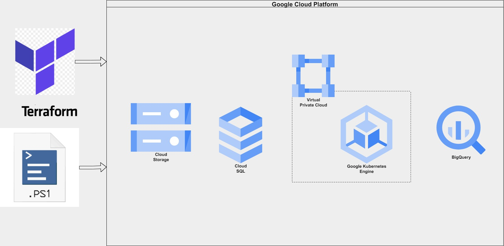
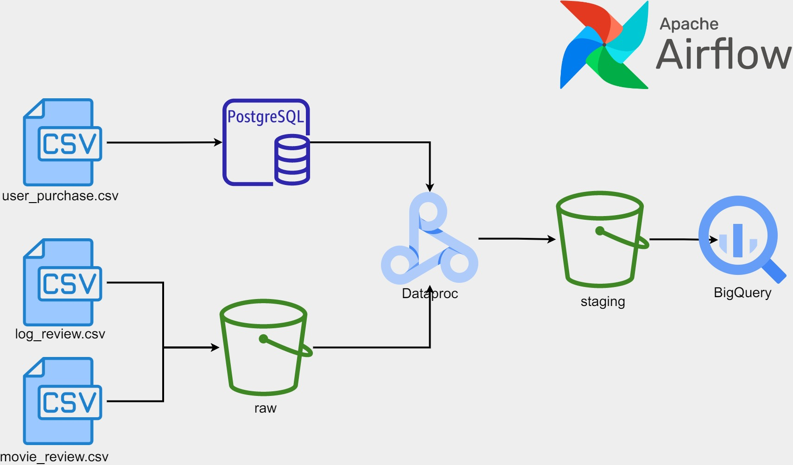

# Movie Analytics Data Pipeline
The goal is to build an end-to-end solution that integrates data from external sources,
clean it and process it for further use by other stakeholders

## Problem Description
The data from fact_movie_analytics
is helpful for analysts and tools like dashboard software.
The table fact_movie_analytics takes information from:

 - A PostgreSQL table named user_purchase.
 - Daily data by an external vendor in a CSV file named movie_review.csv that
    populates the classified_movie_review table. This file contains a customer id,
    a review id, and the message from the movie review.
 - Daily data by an external vendor in a CSV file named log_reviews.csv. This file
    contained the id review and the metadata about the session when the movie
    review was done, like log date, device (mobile, computer), OS (windows, Linux),
    region, browser, IP, and phone number.

## Tech Stack (Infrastructure)
The project was implemented using Google Cloud Platform

Cloud Services:
 - Cloud SQL: used the PostgreSQL table
 - Cloud Storage: used for staging and source of the csv files
 - BigQuery: For the OLAP table, the final destination
 - Google Kubernetes Engine (GKE): for compute power, running of Apache-Airflow

 Orchestration: Apache Airflow

 Infrastructure-as-a-code: Terraform

 Deployment: Powershell

### Data Pipeline:

## Outcome:
DAG:
.png)